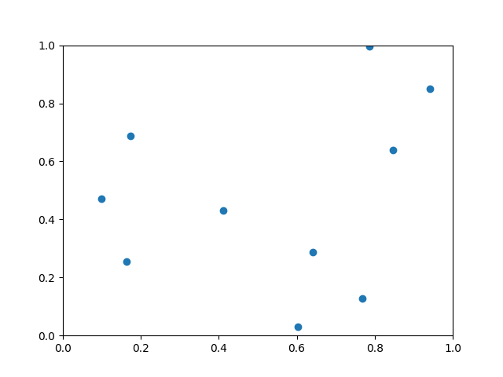
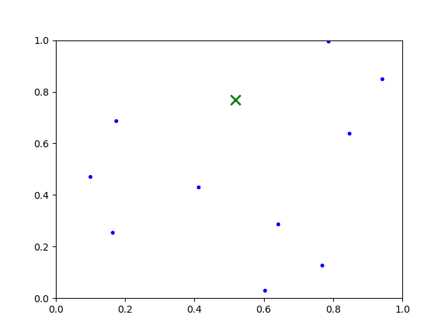

# Voronoi Diagram
Program that calculates the optimal location of a new point according to the given points.

## Example
### Input data
Input must be a .csv file looking like this.

| ID | X | Y |
|:--:|--:|--:|
|0   |0.7856490658429476|0.9967078397368732|
|1   |0.7690738708610362|0.12723780755835568|
|...|

#### Points on surface



In given set of points, we search for optimal place for new point. 

### Console output

```
Provide file name (csv extension): ../points.csv
Set precision (decimal places): 7
Optimal place:
Point ID: -1, x: 0.5174322, y: 0.7676538
Data to visualize is in file visualize.txt
```

#### Points on surface with new point found



There also should be created ```visualize.txt``` file which contains data you can use in simple [visualizator](https://github.com/Dar3cz3Q/voronoi-diagram-visualizator)

## Running program
### Visual Studio
Download repository and just run **Local Windows Debugger**. Program will ask for file location etc.

## References
* https://en.wikipedia.org/wiki/Delaunay_triangulation
* https://en.wikipedia.org/wiki/Bowyer%E2%80%93Watson_algorithm
